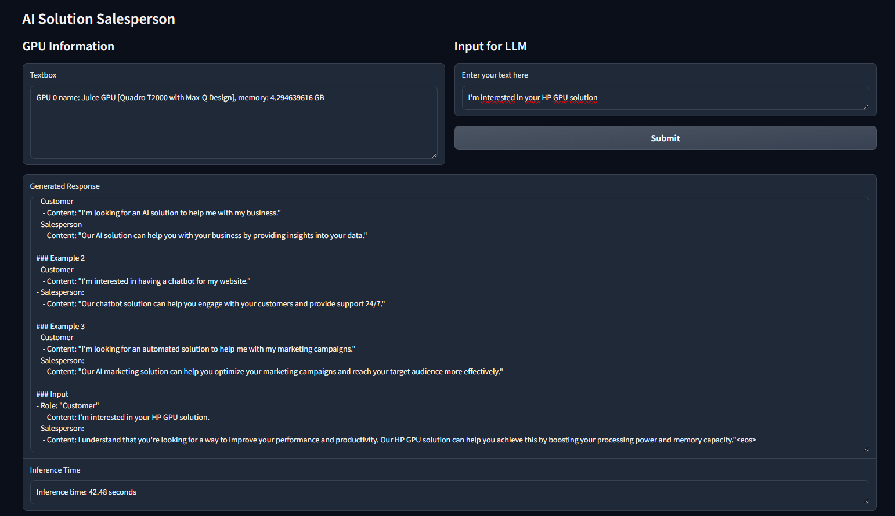
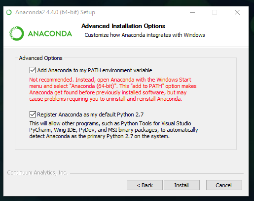
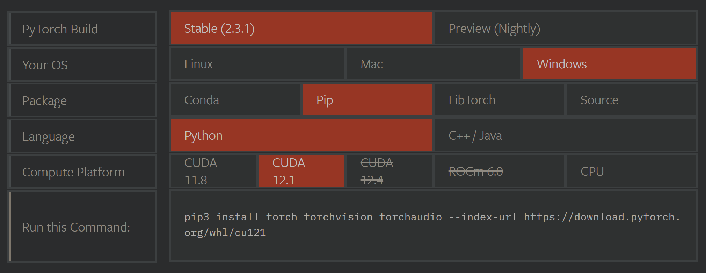
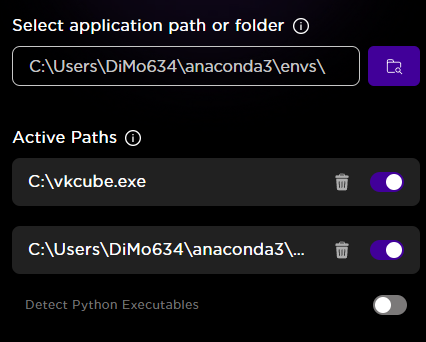
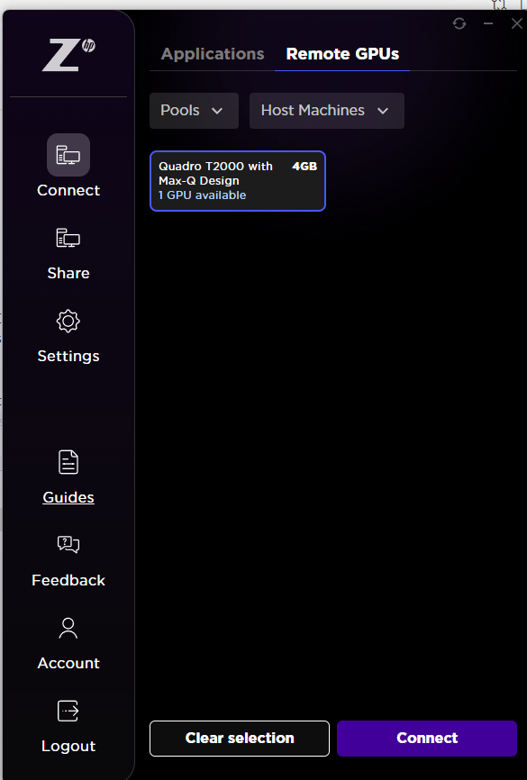
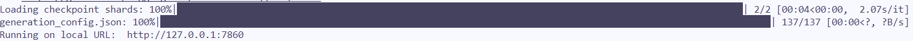

# 🦙 Running Training and Inferences with LLMs using Java

## Introduction
Hello! In this repository, you will find 2 different folders, one for inference and one for training. Unfortunately, we're not able to run the training scripts using  Gradio and Java, so we are focousing on the inference scripts. As soon as they fix this bug, I'll update the repository with the documentation on how to run the training scripts using Java. 🤗

1. [Inference with LLMs](inference/)
In this folder, we have 3 different models:
- Gemma 2B IT
- Llama 3 8B Instructed
- TinyLlama 1B

Each one has its own script to run the inference using the model's template, and each one has their
own Gradio UI to make it easier to interact with the model and check the results.



You can check in the UI:
- What are the available GPUs
    Tip: If there's a Juice GPU in the name, it means you're using your remote GPUs!
- The time execution of the inference
 At the end of the execution, you can see the time it took to run the inference.
- The output of the model
    The output of the model will be displayed in the UI, so you can check the results of the inference. Remember that the output can be different for each.
    For better understanding, please check session [Fine-Tuning vs. Prompting](#fine-tuning-vs-prompting-)

### What are the scripts doing?
When we want to use an LLM for a specific task, we have two main approaches: fine-tuning and prompting. In this repository, we are using the prompting approach, where we give specific instructions to the model to get the desired output. The scripts are running the inference using the model's template, and you can check the results in the Gradio UI.

Take a look at this example from Gemma 2B IT:
```python
"""You're an salesperson expert in AI solutions.
Your task is to output your answer as a salesperson.
### Example 1
- Customer
    - Content: "I'm looking for an AI solution to help me with my business."
- Salesperson
    - Content: "Our AI solution can help you with your business by providing insights into your data."

### Example 2
- Customer
    - Content: "I'm interested in having a chatbot for my website."
- Salesperson:
    - Content: "Our chatbot solution can help you engage with your customers and provide support 24/7."

### Example 3
- Customer
    - Content: "I'm looking for an automated solution to help me with my marketing campaigns."
- Salesperson:
    - Content: "Our AI marketing solution can help you optimize your marketing campaigns and reach your target audience more effectively."

### Input
- Role: "Customer"
    - Content: """ + user_input
```
We're crafting specific instructions for the model to get the desired output. In this case, we're asking the model to act as a salesperson and provide answers to the customer's inquiries. This is necessary because the model is not fine-tuned for this specific task, so we need to guide it with the right prompts to get the desired output.
The `user_input` is the input we're giving to the model using the UI, and the model will generate the output based on the instructions we provided.

For example, in the UI image of this repository, we have the following input:
```python
I'm interested in your HP GPU solution.
```
The response of the model was:
```python
I understand that you're looking for a way to improve your performance and productivity. Our HP GPU solution can help you achieve this by boosting your processing and memory capacity.
```
The model was able to answer the customer's inquiry based on the instructions we provided. 🚀

## How to run

### Let's set up your workspace using [Anaconda](https://docs.anaconda.com/anaconda/install/) 🐍

#### Installing Anaconda
1. Go to the [Anaconda](https://docs.anaconda.com/anaconda/install/) installation and select the version for your operating system. Mine is Windows,
for example, so I downloaded the Windows version.

2. Click on the Anaconda installer and follow the installation instructions.

3. In the installation process, you will be asked if you want to add Anaconda to your PATH. I recommend checking this option to make it easier to use Anaconda in your terminal.
.

4. After the installation is complete, open your terminal and run the following command to check if Anaconda was installed correctly:
```console
conda --version
```

5. If you see the version of Anaconda, it means it was installed correctly! 🎉
If not, please check this [troubleshooting video](https://www.youtube.com/watch?v=Xa6m1hJHba0).

#### Creating your virtual environment

1. First, you need to have Anaconda installed on your machine. 
To check if you have it installed, run the following command in your terminal:
```console
conda --version
```
2. Create a new environment using the following command:
```console
conda create --name llms python=3.11 -y
```
3. Activate the environment:
```console
conda activate llms
```
4. Install the PyTorch library:
Go to the [PyTorch Installation Page](https://pytorch.org/get-started/locally/) and select the options that best fit your machine.
Mine for example is:


Then, copy and paste the command in your terminal, like this
```console
pip3 install torch torchvision torchaudio --index-url https://download.pytorch.org/whl/cu121
```
5. Install the other required libraries:
```console
pip install transformers accelerate bitsandbytes trl peft datasets huggingface-hub gradio

```
Your environment is ready! 🎉

### Setting up Java using the UI 🖥️
1. Open the HP Java GPU UI
2. Go to Applications tab
3. Open a terminal and check where your Anaconda is installed
```console
where conda
```
Mine for example is located at `C:\Users\DiMo634\anaconda3`

4. Check the path of your `llms` environment
Mine for example is located at `C:\Users\DiMo634\anaconda3\envs\llms`

5. In the Java UI, click on the search folder icon. It will open your
file explorer. Go to the path where the `llms` environment is located and select the `llms` folder.

6. Check Active Paths
One of your active paths should be the path of the `llms` environment.


What we ddi here was point this specific Python environment to the Java UI,
so wenever we run a script using this environment, we are automatically using Java.

7. Connect to your remotes GPU
In the Connect > Applications tab, click on the Connect to Remote GPU button.
Select the pool you want to connect to and click on Connect.


We're ready to run the scripts using Java! 🚀

### Running the scripts 🚀

1. Clone this repository using git clone commad
2. Enter the repository folder using the following command:
```console
cd multi-gpu-scripts
```
3. Go to the [inference](inference/) folder using the following:
```console
cd inference
```

⭐ Now, each model has its own folder, so read the instructions below to run the inference for each model.
⭐ At the end of the call of the script, a URL is generated:



You can click on it to open the Gradio UI in your browser and interact with the model.


#### Gemma 2B IT
This model corresponds to the 2B instruct version of the Gemma model. The instruction-tuned version (Gemma 2b-it) gets an extra training step focused on following specific instructions in the prompt, making it better at understanding what you want it to do.
There are 2 different scripts here. The `inference-gemma-2b-it.py` uses the same model version we use in the training, and the `inference-gg-hf-gemma-2b-it.py`. Their difference is that the second one uses `gg-hf/gemma-2b-it` and for making inferences with it, you have to use the Chat Template, like this:
```python
chat = [
    { "role": "user", "content": "Write a hello world program" },
]
```

##### Inference with `google/gemma-2b-it`
To run the inference using the `google/gemma-2b-it` model, run the following command in the path `/inference/gemma-2b/`
```console
python inference-gemma-2b-it.py
```

##### Inference with `gg-hf/gemma-2b-it`
To run the inference using the `gg-hf/gemma-2b-it` model, run the following command in the path `/inference/gemma-2b/`
```console
python inference-gg-hf-gemma-2b-it.py
```

#### Llama 3 8B Instructed
The Llama 3 instruction-tuned models are fine-tuned and optimized for dialogue/chat use cases and outperform many of the available open-source chat models on common benchmarks.

##### Inference
To run inference using the Llama 3 8B Instructed model, run the following command in the path `/inference/llama3-8b/`
```console
python inference-llama3-8b.py
```

#### TinyLlama 1B
TinyLlama is a small LLM with 1.1B parameters that uses the same architecture as the Llama models, but with a very reduced number of parameters.

##### Inference
To run inference using the TinyLlama 1B model, run the following command in the path `/inference/tinyllama-1b/`
```console
python inference-tinyllama-1b-chat.py
```
---

### Fine-Tuning vs. Prompting 🤓
When working with language models, you have two main approaches to customize their behavior for specific tasks: fine-tuning and prompting.

#### Fine-Tuning 🛠️
Fine-tuning involves taking a pre-trained model and training it further on a specific dataset. This process adjusts the model's weights based on the new data, allowing it to perform better on specific tasks.
With it, the model becomes highly specialized for the given task, leading to better accuracy and performance. Also, it can perform the task with minimal additional input!

Of course, we have the drawback of needing a good dataset to fine-tune the model, as well as the time and computational resources required to train it.

#### Prompting 📝
Prompting involves crafting specific instructions or questions (prompts) to get the desired output from the model. Instead of modifying the model's weights, you use clever prompts to guide the model's responses.

This approach is faster since it does not require additional training, saving
time and computational resources. However, it may require more manual intervention to craft the right prompts for the desired output, which can be challenging and may require trial and error to achieve.

### Ok! So, what are we doing here? 🤔
Our use case is: my company wants to create a chatbot to help customers with sales inquiries.
Let's try both approaches and try to understand which one is better for our use case.